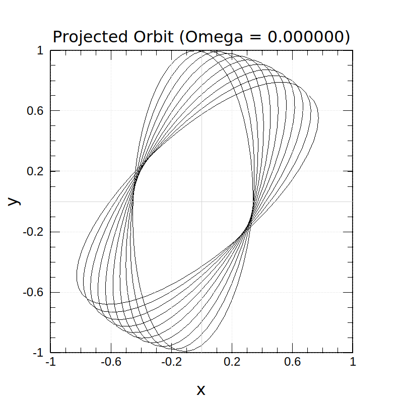
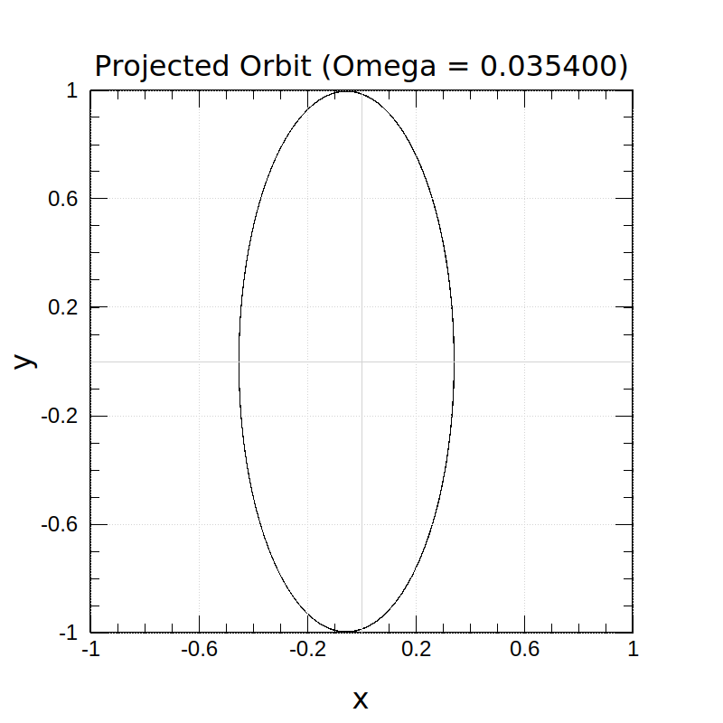
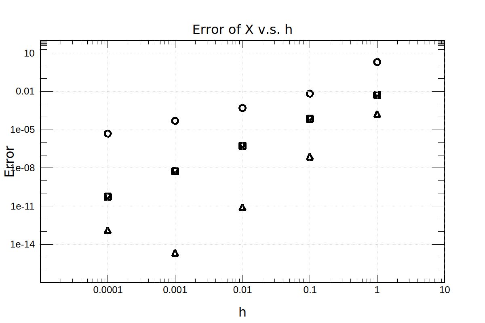
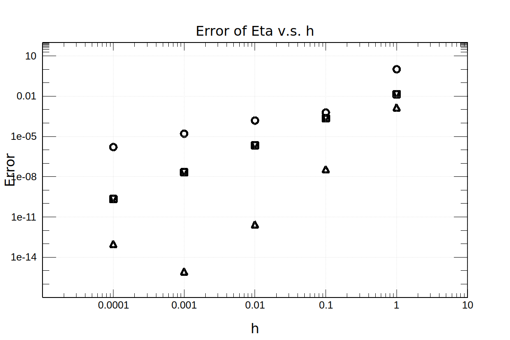
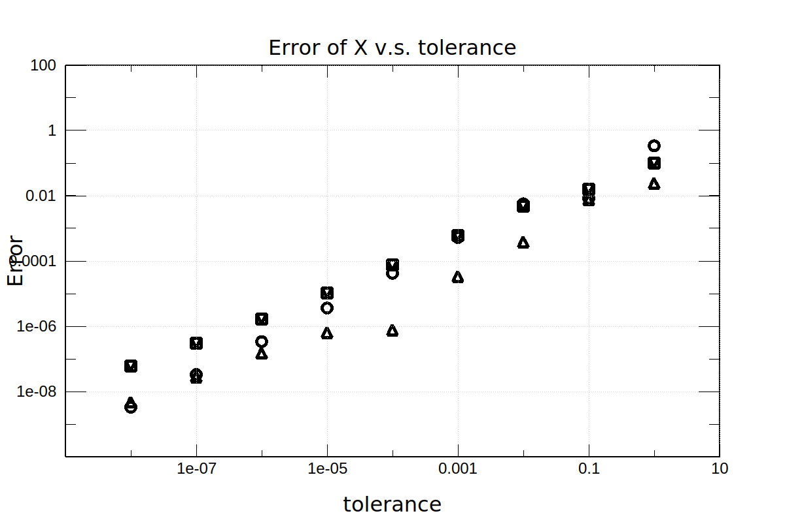
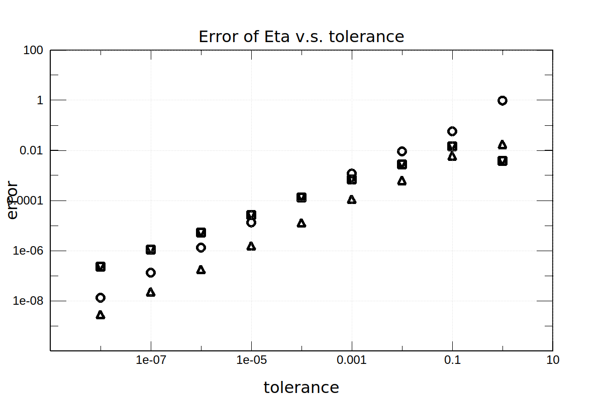

# Assignment 11

#### Shuyang Cao

## Chapter 11 Exercise 4

Choosing generalized coordinates as $\theta$ and $\phi$, the Hamiltonian is

$$
H=\frac{1}{2ma^2}\left({p_\theta}^2+\frac{{p_\phi}^2}{\sin^2\theta}\right)-mga\cos\theta
$$

where
$$
\begin{aligned}
    p_\phi & = ma^2 \sin^2\theta \dot{\phi}\\
    p_\theta & = ma^2 \dot{\theta}
\end{aligned}
$$

The intial condition is

$$
\left\{
\begin{aligned}
\theta(t=0) & =\theta_0 \\
\phi(t=0) & = 0 \\
p_\theta(t=0) & = 0 \\
p_\phi(t=0) & = \lambda \equiv ma^{3/2}g^{1/2}
\end{aligned} \right.
$$

The Hamilton's equations are
$$
\begin{aligned}
    \frac{d\theta}{dt} & = \frac{\partial H}{\partial p_\theta} \\
    \frac{d\phi}{dt} & = \frac{\partial H}{\partial p_\phi} \\
    \frac{d p_\theta}{dt} & = -\frac{\partial H}{\partial \theta} \\
    \frac{d p_\phi}{dt} & = -\frac{\partial H}{\partial \phi}
\end{aligned}
$$

For simplicty, we set $a=1, g=1, m=1$. We also set $\theta_0=\pi/9$. The figure is plotted using following two functions.

$$
\begin{aligned}
    x(t) & = \sin(\theta)\cos(\phi+\Omega t) \\
    y(t) & = \sin(\theta)\sin(\phi+\Omega t) \\
\end{aligned}
$$

where $\Omega$ is the precession rate to be determined. Setting $\Omega=0$ gives the solution. Setting $\Omega$ to the precession rate aligns the orbit in one ellipse.

Through a binary search, it is found that orbits become indistinguishable whe $\Omega\in[0.0353,0.0356]$

## Chapter 11 Exercise 10

### a

The analytic solution when $\zeta=1/2$ is

$$
\begin{aligned}
    x(\tau) & = \frac{e^{-\frac{\tau }{2}} \left(\sqrt{3} c_1 \cos \left(\frac{\sqrt{3} \tau }{2}\right)+(c_1+2 c_2) \sin \left(\frac{\sqrt{3} \tau }{2}\right)\right)}{\sqrt{3}} \\
    \eta(\tau) & = \frac{e^{-\frac{\tau }{2}} \left(\sqrt{3} c_2 \cos \left(\frac{\sqrt{3} \tau }{2}\right)-(2 c_1+c_2) \sin \left(\frac{\sqrt{3} \tau }{2}\right)\right)}{\sqrt{3}}
\end{aligned}
$$

For part b and c, we choose $c_1=c_2=1$.

$$
\begin{aligned}
    x(\tau) & = 2 e^{-\frac{\tau }{2}} \sin \left(\frac{\sqrt{3} \tau }{2}+\frac{\pi }{6}\right) \\
    \eta(\tau) & = 2 e^{-\frac{\tau }{2}} \sin \left(\frac{\pi }{6}-\frac{\sqrt{3} \tau }{2}\right)
\end{aligned}
$$

In other words, we choose initial conditions as

$$
x(\tau) = \eta(\tau) = 1
$$

### b & c

1. CIRCLE: Euler
2. SQUARE: Midpoint
3. TRIANGLE_L: Trapezoid
4. TRIANGLE_U: Classical Runge-Kutta

Different slopes in "Error of X v.s. h"
 or "Error of Eta v.s. h" suggests that those algorithms are of different order fo accuracy.

In "Error of X v.s. tolerance" or "Error of Eta v.s. tolerance", slopes are the same because the error is directly controlled by the user-defined tolerance. Their different orders of accuracy are exhibited in different total number of steps they need to reach the same error.

## Chapter 11 Exercise 14

### a

[Reference 1](https://diego.assencio.com/?index=1500c66ae7ab27bb0106467c68feebc6)

$$
\begin{aligned}
    L = & \frac{1}{2}\left(m_1+m_2\right){l_1}^2\dot{\theta_1}^2 + \frac{1}{2}m_2{l_2}^2\dot{\theta_2}^2 + m_2 l_1 l_2\dot{\theta_1}\dot{\theta_2}\cos\left(\theta_1-\theta_2\right)\\
    & + \left(m_1+m_2\right)gl_1\cos\theta_1 + m_2gl_2\cos\theta_2
\end{aligned}
$$

### b

[Reference 2](https://diego.assencio.com/?index=e5ac36fcb129ce95a61f8e8ce0572dbf)

$$
\begin{aligned}
    H = & \frac{m_2{l_2}^2p_{\theta_1}^2 + \left(m_1+m_2\right){l_1}^2p_{\theta_2}^2 - 2 m_2 l_1 l_2 p_{\theta_1} p_{\theta_2}\cos\left(\theta_1-\theta_2\right)}{2m_2 {l_1}^2 {l_2}^2 \left[m_1 + m_2 \sin^2\left(\theta_1-\theta_2\right)\right]} \\
    & - \left(m_1+m_2\right)gl_1\cos\theta_1 - m_2gl_2\cos\theta_2 \\
    \\
    p_{\theta_1} = & \left(m_1+m_2\right){l_1}^2\dot{\theta_1} + m_2 l_1 l_2 \dot{\theta_2} \cos\left(\theta_1 - \theta_2\right) \\
    \\
    p_{\theta_2} = & m_2 {l_2}^2\dot{\theta_2} + m_2 l_1 l_2 \dot{\theta_1} \cos\left(\theta_1 - \theta_2 \right)
\end{aligned}
$$

### c

[Reference 2](https://diego.assencio.com/?index=e5ac36fcb129ce95a61f8e8ce0572dbf)

$$
\begin{aligned}
    \dot{\theta_1} = & \frac{l_2 p_{\theta_1} - l_1 p_{\theta_2}\cos\left(\theta_1 - \theta_2\right)}{{l_2}^2 l_2 \left[m_1 + m_2 \sin^2\left(\theta_1 - \theta_2\right)\right]} \\
    \\
    \dot{\theta_2} = & \frac{-m_2 l_2 p_{\theta_1}\cos\left(\theta_1 - \theta_2\right) + \left(m_1 + m_2\right)l_1 p_{\theta_2}}{m_2 l_1 {l_2}^2 \left[m_1 + m_2 \sin^2\left(\theta_1 - \theta_2\right)\right]} \\
    \\
    \dot{p}_{\theta_1} = & -\left(m_1 + m_2\right)gl_1\sin\theta_1 - h_1 + h_2\sin\left[2\left(\theta_1-\theta_2\right)\right] \\
    \\
    \dot{p}_{\theta_2} = & -m_2 g l_2 \sin\theta_2 + h_1 - h_2 \sin\left[2\left(\theta_1-\theta_2\right)\right]
\end{aligned}
$$

where

$$
\begin{aligned}
    h_1 = & \frac{p_{\theta_1} p_{\theta_2} \sin\left(\theta_1 - \theta_2\right)}{l_1 l_2 \left[m_1 + m_2 \sin^2\left(\theta_1 - \theta_2\right)\right]} \\
    \\
    h_2 = & \frac{m_2 {l_2}^2 p^2_{\theta_1} + \left(m_1+m_2\right){l_1}^2 p^2_{\theta_1} - 2m_2 l_1 l_2 p_{\theta_1} p_{\theta_2} \cos\left(\theta_1-\theta_2\right)}{2{l_1}^2 {l_2}^2 {\left[m_1+m_2\sin^2\left(\theta_1-\theta_2\right)\right]}^2}
\end{aligned}
$$

### d

For simplicity, set $m_1 = 1, m_2 = 2, l_1 = 2, l_2 = 1, g = 1$. This is nothing special but choosing a new unit system.

The simulation time goes from 0 to 105.

#### i

The orbit fills a parallelogram.

.png)

#### ii

The initial condition is an unstable equilibrium point. Theoretically, the system will stay at the intial point. But error in the numerical integration will add a perturbation in the system. Therefore, eventually, the system will slide off the equilibrium point.

The following two figures show how error accumulated during integration affect the behavior of system. The system slides off the equilibrium point suddenly between $t=100$ and $t=105$.

.png)

.png)
