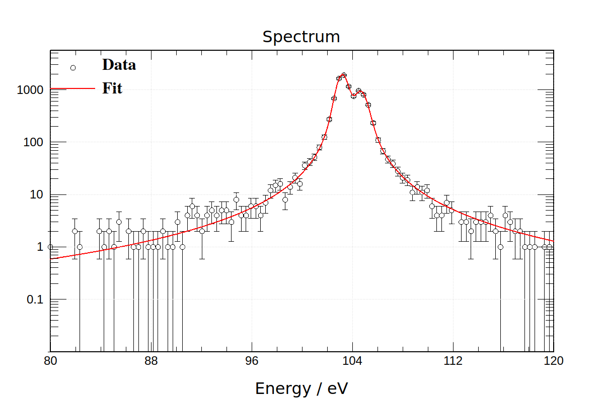
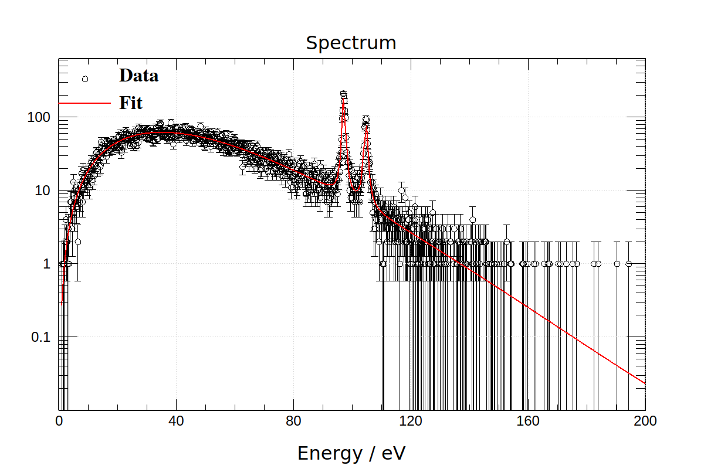

# Assignment 12

#### Shuyang Cao

## Chapter 16 Exercise 3

### a

```
$ ./a 
Data Num: 1000
Data Min: 19.6259
Data Max: 186.357
Data Mean: 103.237
Data Variance: 22.0979
Data Sigma: 4.70084

Lorentz Fit
Minuit2Minimizer : Valid minimum - status = 0
FVAL  = -11605.7826902987945
Edm   = 1.17720623391576328e-08
Nfcn  = 64
Mu	  = 103.216	 +/-  0.0106107	(limited)
Gamma	  = 0.239449	 +/-  0.0108093	(limited)

Gauss Fit
Minuit2Minimizer : Valid minimum - status = 0
FVAL  = -7882.14926128845582
Edm   = 9.3478949721962934e-07
Nfcn  = 80
Mu	  = 103.237	 +/-  0.148648	(limited)
Sigma	  = 4.70066	 +/-  3.92862	(limited)
```

An unbinned likelihood fit is used. From either the figure below or the uncertainties above, we can tell that Lorentzian distribution is a much better fit compared with a Gaussian distribution. The half line width and the lifetime of the state are

$$
\gamma\approx0.239449\,eV \quad\Rightarrow\quad \tau = \frac{\hbar}{2\gamma}\approx1.37443\,fs
$$


### b

The two peaks are not well resolved, which cause the success of the fit heavily relies on the selected initial values. Hence, the fit is accomplished in three steps.

First, we do a coarse search. We choose initial values randomly and uniformly, whose ranges are shown below. One can easily find that these ranges are loose and cover almost all possible values.

We run independent fittings until 100 success. Note that not all fittings will succeed. Parameters from successful fittings are then binned with a weight defined as the inverse of the sqaure root of the trace of the error matrix.

The mean values and deviations of those parameters, computed from histograms, are stored for next step. Note that the deviation here is not the uncertaity in the fitting. The deviation comes from that we search the whole parameter space. The uncertainties from fitting are used to weight fitting results.

```cpp
const double fMin = 0.01;
const double fMax = 0.99;
const double mu1Min = 80;
const double mu1Max = 120;
const double mu2Min = mu1Min;
const double mu2Max = mu1Max;
const double gamma1Min = 0.01;
const double gamma1Max = 1;
const double gamma2Min = gamma1Min;
const double gamma2Max = gamma1Max;
```

```bash
$ ./coarse 
Data Num: 1000
Data Min: 12.5849
Data Max: 294.115
Data Mean: 103.942
Data Variance: 88.67
Data Sigma: 9.41647

Coarse Search
Mu1 :101.863 +/- 4.41358
Mu2 :104.538 +/- 0.369228
Gamma1 :0.222673 +/- 0.0732899
Gamma2 :0.383323 +/- 0.0335544
Fraction :0.680145 +/- 0.000949051
```


Second, we do a grain search. The procedure is the same as the first step except that we search only in a small part of the parameter space, which is narrowed by the coarse searching result, as shown below.

```cpp
void initializeParameter()
{
    std::ifstream iFile(coarseResultFile);
    double mu1, mu2, gamma1, gamma2, f;
    double mu1Sig, mu2Sig, gamma1Sig, gamma2Sig, fSig;

    iFile >> mu1 >> mu1Sig;
    iFile >> mu2 >> mu2Sig;
    iFile >> gamma1 >> gamma1Sig;
    iFile >> gamma2 >> gamma2Sig;
    iFile >> f >> fSig;

    fMin = f - fSig; fMax = f + fSig;
    mu1Min = mu1 - mu1Sig; mu1Max = mu1 + mu1Sig;
    mu2Min = mu2 - mu2Sig; mu2Max = mu2 + mu2Sig;
    gamma1Min = gamma1 - gamma1Sig; gamma1Max = gamma1 + gamma1Sig;
    gamma2Min = gamma2 - gamma2Sig; gamma2Max = gamma2 + gamma2Sig;
}
```

```bash
$ ./grain 
Data Num: 1000
Data Min: 12.5849
Data Max: 294.115
Data Mean: 103.942
Data Variance: 88.67
Data Sigma: 9.41647

Grain Search
Mu1 :103.194 +/- 1.20631e-05
Mu2 :104.651 +/- 2.81617e-05
Gamma1 :0.235249 +/- 0.000119722
Gamma2 :0.373914 +/- 0.000510441
Fraction :0.680956 +/- 1.22205e-05
```


Last, we use meaning values from the grain search as initial values of our fitting. The result is shown below. This time, the uncertainties comes from the fitting.

```bash
$ ./bestfit 
Data Num: 1000
Data Min: 12.5849
Data Max: 294.115
Data Mean: 103.942
Data Variance: 88.67
Data Sigma: 9.41647

Minuit2Minimizer : Valid minimum - status = 0
FVAL  = -10711.8327925548147
Edm   = 8.44768595579371858e-06
Nfcn  = 86
Mu1	  = 103.194	 +/-  0.0134327	(limited)
Mu2	  = 104.651	 +/-  0.0359933	(limited)
Gamma1	  = 0.235254	 +/-  0.0162998	(limited)
Gamma2	  = 0.372176	 +/-  0.0416402	(limited)
fraction	  = 0.680054	 +/-  0.0241262	(limited)
```


### c

We discard some outliers in our dataset.

The first line is at $103.201\pm0.00959624\,eV$ with a fraction $0.651599\pm0.0118062$.

The second line is at $104.691\pm0.0195155\,eV$ with a fraction $0.348401\pm0.0118062$.

The extra uncertainty due to the experimental resolution is $0.320004\pm0.0113027\,eV$.

```bash
$ ./c 
Raw Data Min: -1743.18
Raw Data Max: 1129.97

Data Selection Range: [0, 400]

Data Num: 9994
Data Min: 12.9151
Data Max: 320.296
Data Mean: 103.847
Data Variance: 43.0491
Data Sigma: 6.56118

Minuit2Minimizer : Valid minimum - status = 0
FVAL  = -130828.57156210886
Edm   = 1.88820038293002343e-06
Nfcn  = 560
Fraction	  = 0.651599	 +/-  0.0118062	(limited)
Mu1	  = 103.201	 +/-  0.00959624	(limited)
Mu2	  = 104.691	 +/-  0.0195155	(limited)
Delta1	  = 0.232105	 +/-  0.0127455	(limited)
Delta2	  = 0.338425	 +/-  0.0197809	(limited)
Sigma	  = 0.320004	 +/-  0.0113027	(limited)
```



### d

The black body radiation spectrum is

$$
P(E) = \frac{15}{\pi^4 T^4}\frac{E^3}{e^{E/T} - 1}
$$

where $A$ is a factor depending on the net power of the spectrum.

Note that

$$
\langle E\rangle = \frac{360\zeta (5)}{\pi ^4}T \approx 3.83223 T
$$

We set the intial value of the fitted $T$ as $\bar{E}/3$.

The fitted temperature is $12.5188\pm0.0661569\,eV$

```bash
$ ./d 
Raw Data Min: 1.72219
Raw Data Max: 178.493

Data Selection Range: [0, 200]

Data Num: 10000
Data Min: 1.72219
Data Max: 178.493
Data Mean: 47.9765
Data Variance: 640.232
Data Sigma: 25.3028

Minuit2Minimizer : Valid minimum - status = 0
FVAL  = -58653.3294512698703
Edm   = 1.13562725919419143e-08
Nfcn  = 22
T	  = 12.5188	 +/-  0.0661569	(limited)
```


### e

Three outliers are discarded.

The fitted result are shown below.

```bash
$ ./e 
Raw Data Min: -22.0798
Raw Data Max: 1758.8

Data Selection Range: [0, 200]

Data Num: 19997
Data Min: 0.993354
Data Max: 194.289
Data Mean: 52.9739
Data Variance: 809.769
Data Sigma: 28.4564

Minuit2Minimizer : Valid minimum - status = 0
FVAL  = -148614.889886645658
Edm   = 1.60024802655073138e-06
Nfcn  = 607
T	  = 12.4445	 +/-  0.0545055	(limited)
Mu1	  = 97.2018	 +/-  0.0171042	(limited)
Delta1	  = 0.294907	 +/-  0.030401	(limited)
Mu2	  = 104.71	 +/-  0.0281897	(limited)
Delta2	  = 0.37393	 +/-  0.0382014	(limited)
Sigma	  = 0.255862	 +/-  0.0348203	(limited)
fPlank	  = 0.898904	 +/-  0.00261236	(limited)
fLine1	  = 0.656881	 +/-  0.012862	(limited)
```



## Chapter 16 Exercise 7


The potential is 

$$
V = -\frac{k}{r}
$$

where $k=GM_\odot m$

THe equation of the orbit is

$$
r=\frac{a(1-e^2)}{1+e\cos(\theta-\theta_0)}
$$

where $a$ is the semimajro axis, $e$ is the eccentricity.

We also have

$$
\frac{l^2}{mk} = a(1-e^2)
$$

where $l$ is the angular momenturm $l=m\dot{\theta}r^2$.

Therefore,

$$
\dot{\theta}r^2 = \sqrt{GMa(1-e^2)}
$$