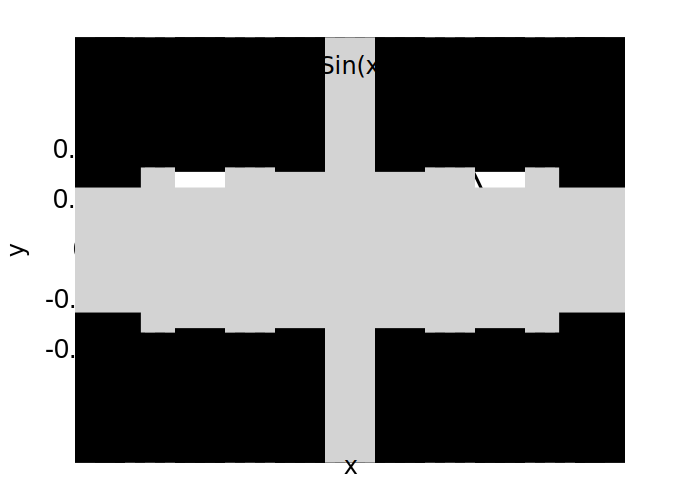
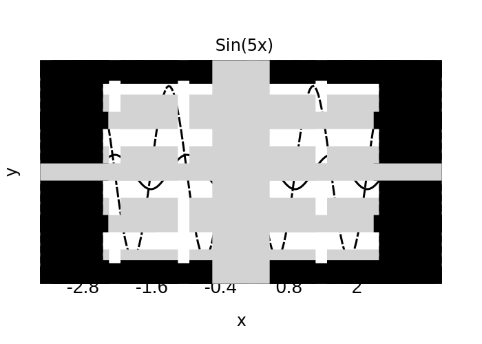
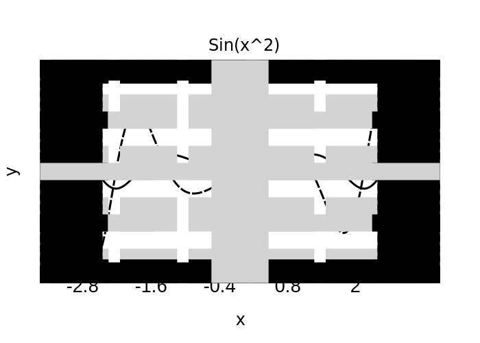
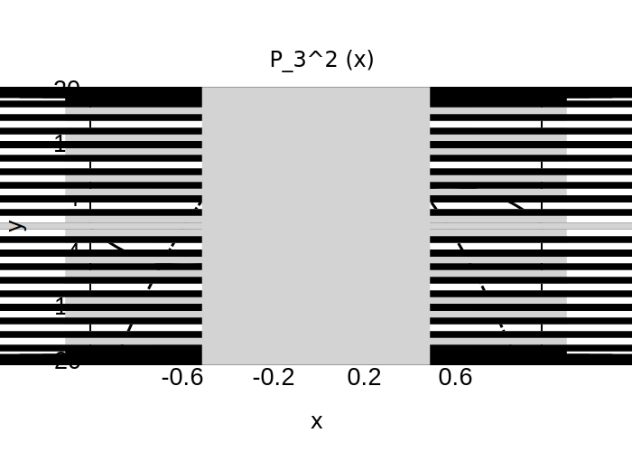
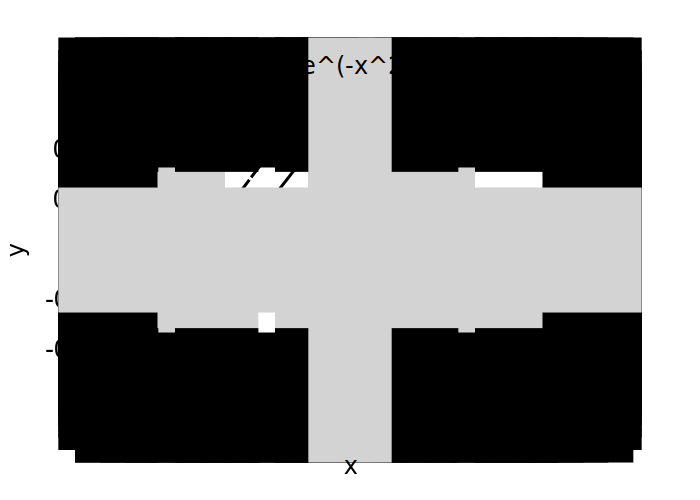
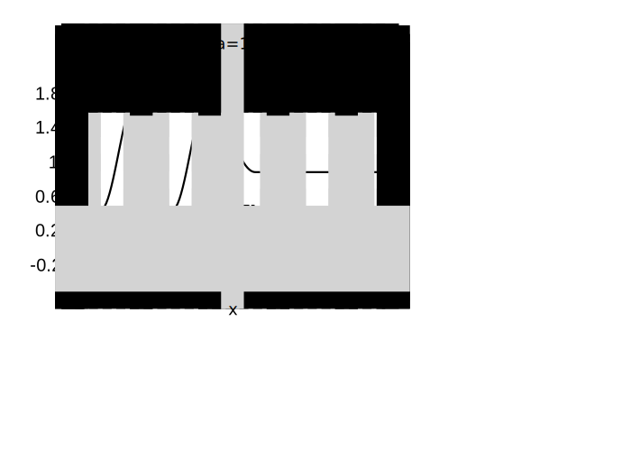
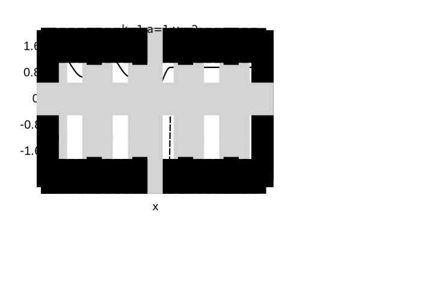

# Assignment 3

#### Shuyang Cao

## Chapter 3 Exercise 1

The volume spanned by three vectors can be computed through

* $\vec{a}_1 \cdot (\vec{a}_2 \times \vec{a}_3)$
* $|A|$ where row vectors of $A$ are made up of $\vec{a}_1, \vec{a}_2, \vec{a}_3$

Note that volume is always positive so we need to take the absolute value.

```bash
$ ./volume 
Vector 0: 3 0 0
Vector 1: 0.5   2   0
Vector 2: 0.3 0.2 1.5
Volume computed from triple product: 9

Matrix: 
  3   0   0
0.5   2   0
0.3 0.2 1.5
Volume computed from determinant: 9
```

## Chapter 3 Exercise 3

```bash
$ ./plot -h
Usage: ./plot [options] functionNumber
This program plots six functions and their derivatives.
	1. sin(x)
	2. sin(5x)
	3. sin(x^2
	4. e^(-x)sin(x)
	5. Associated Legendre Polynomial with n = 3 and m = 2
	6. Gaussian Distribution


Options:
  -h, --help     Displays this help.
  -v, --version  Displays version information.
  -p, --prime    flag to plot derivative of the chosen function.

Arguments:
  functionNumber Serial number of the function to be plotted.
```

### Function Graphs

* 
* 
* 
* 
* 
* 

## Chapter 3 Exercise 6

```bash
$ ./density
./density k v a
Plot the probability density for a 1D rectangular barrier.
Arguments:
    k        wave vector of incident wave (k > 0)
    v        ratio between barrier height and energy
    a        halfwidth of the barrier (a > 0)
```

### Density Graph

* 
* 
* 