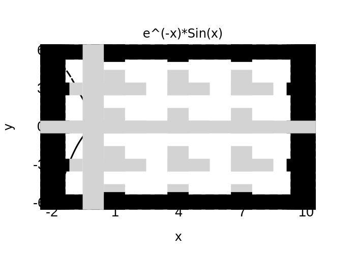
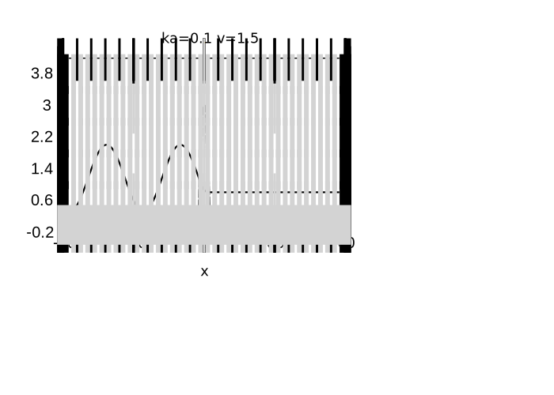

# Assignment 3

#### Shuyang Cao

## Chapter 3 Exercise 1

The volume spanned by three vectors can be computed through

* $\vec{a}_1 \cdot (\vec{a}_2 \times \vec{a}_3)$
* $|A|$ where row vectors of $A$ are made up of $\vec{a}_1, \vec{a}_2, \vec{a}_3$

Note that volume is always positive so we need to take the absolute value.

```bash
$ ./volume 
Vector 0: 3 0 0
Vector 1: 0.5   2   0
Vector 2: 0.3 0.2 1.5
Volume computed from triple product: 9

Matrix: 
  3   0   0
0.5   2   0
0.3 0.2 1.5
Volume computed from determinant: 9
```

## Chapter 3 Exercise 3

```bash
$ ./plot -h
Usage: ./plot [options] functionNumber
This program plots six functions and their derivatives.
	1. sin(x)
	2. sin(5x)
	3. sin(x^2
	4. e^(-x)sin(x)
	5. Associated Legendre Polynomial with n = 3 and m = 2
	6. Gaussian Distribution


Options:
  -h, --help     Displays this help.
  -v, --version  Displays version information.
  -p, --prime    flag to plot derivative of the chosen function.

Arguments:
  functionNumber Serial number of the function to be plotted.
```

### Function Graphs

* 
* 
* 
* 
* 
* 

## Chapter 3 Exercise 6

```bash
$ ./density
./density k v a
Plot the probability density for a 1D rectangular barrier.
Arguments:
    k        wave vector of incident wave (k > 0)
    v        ratio between barrier height and energy
    a        halfwidth of the barrier (a > 0)
```

### Density Graph

* 
* 
* 

## Chapter 3 Exercise 7

$$
\Psi(x)=\left\{
\begin{array}{ll}
	A{e}^{ikx} + B{e}^{-ikx} & x \leq -2a \\
	C{e}^{ik_1x} + D{e}^{-ik_1x} & -2a < x \leq -a\\
	Fe^{ik_2x} + Ge^{-ik_2x} & -a < x \leq a\\
	He^{ik_1x} + Me^{-ik_1x} & a < x \leq 2a\\
	Pe^{ikx} & x > 2a
\end{array} 
\right.
$$

*where*

$$
k=\sqrt{\frac{2mE}{\hbar^2}}, k_1=k\sqrt{1-v}, k_2=\sqrt{1-2v}
$$

*Define*

$$
b=B/A, c=C/A, d=D/A, f=F/A, g=G/A, h=H/A, m=M/A, p=P/A
$$

Liear equations is

$$
\begin{pmatrix}
	e^{2ika} & -e^{-2ik_1a} & -e^{2ik_1a} & 0 & 0 & 0 & 0 & 0 \\
	0 & e^{-ik_1a} & e^{ik_1a} & -e^{-ik_2a} & -e^{ik_2a} & 0 & 0 & 0 \\
	0 & 0 & 0 & e^{ik_2a} & e^{-ik_2a} & -e^{ik_1a} & -e^{-ik_1a} & 0 \\
	0 & 0 & 0 & 0 & 0 & e^{2ik_1a} & e^{-2ik_1a} & -e^{2ika} \\
	-ikae^{2ika} & -ik_1ae^{-2ik_1a} & ik_1ae^{2ik_1a} & 0 & 0 & 0 & 0 & 0 \\
	0 & ik_1ae^{-ik_1a} & -ik_1ae^{ik_1a} & -ik_2ae^{-ik_2a} & ik_2ae^{ik_2a} & 0 & 0 & 0 \\
	0 & 0 & 0 & ik_2ae^{ik_2a} & -ik_2ae^{-ik_2a} & -ik_1ae^{ik_1a} & ik_1ae^{-ik_1a} & 0 \\
	0 & 0 & 0 & 0 & 0 & ik_1ae^{2ik_1a} & -ik_1ae^{-2ik_1a} & -ikae^{2ika} \\
\end{pmatrix}
\vec{X}
=
\begin{pmatrix}
	-e^{-2ika} \\
	0 \\
	0 \\
	0 \\
	-ikae^{-2ika} \\
	0 \\
	0 \\
	0 \\
\end{pmatrix}
$$

### Transmission and Reflection Graph

The reflection and transmission graph and colormap are shown below, where the horzitonal axes are ***v*** from -2.5 to 2.5, the vertical axes are ***ka*** from $0^+$ to 3 and the black dashed line indicats $v=0$. ***0*** is mapped to red and ***1*** is mapped to blue. Note that reflection graph and transmission graph are complementary to each other as we expected.

From these graphs we can clearly see the wave-particle duality. Resonance happens at some ka when v < 0. When v > 0, the v where reflection is nearly 100% becomes closer to 1 as ka increases.

* Colormap
  * $0$  $1$
* Reflection
  * 
* Transmission
  * 

## Chapter 3 Exercise 8

As ka increases, the transimisson coefficient decays. The behaviour of the wave fucntion transitions from wave-like to particle like.

* 
* 
* 
* 
* 
* 

## Chapter 3 Exercise 9

As shown below, when k becomes larger, the solution is not stable until a larger N, which is anticipated since larger k corresponds to smaller length scale.

Another feature expected is that as k becomes larger, the transmission with respect to barrier potentials transitions from continuity to a jump, which is also anticipated since particles behaves more classically as k increases.

An artificial feature in the following graph is the transmission coefficient when N=2. This is caused by the way potential is sampled in my program. In this program, potential is sampled at the midpoint of each bin. So when the number of bins is 2, the sampled potentials are far smaller that the real potential.

* $v=0$$v=2$
* 
* 
* 
* 
* 
* 