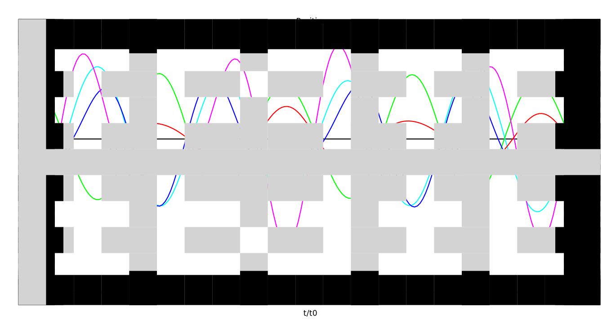
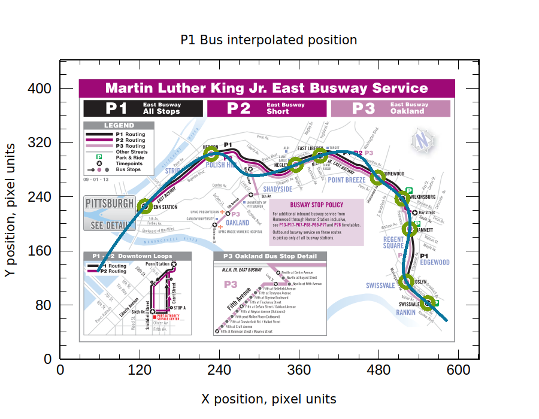

# Assignment 4

#### Shuyang Cao

## Chapter 3 Exercise 13

equations of motion:

$$
\bold{M}\cdot\ddot{\bold{x}}=-\bold{K}\cdot\bold{x}
$$

where

$$
\bold{M}=
\begin{pmatrix}
    m & 0 & 0 & 0 & 0\\
    0 & 3m 0 & 0 & 0 & 0\\
    0 & 0 & 2m  0 & 0 & 0\\
    0 & 0 & 0 & m & 0 &\\
    0 & 0 & 0 & 0 & 2m\\
\end{pmatrix}
$$

$$
\bold{x}=
\begin{pmatrix}
    x_0\\
    x_1\\
    x_2\\
    x_3\\
    x_4
\end{pmatrix}
$$

$$
\bold{K}=
\begin{pmatrix}
    k & -k & 0 & 0 & 0 \\
    -k & 3k & -2k & 0 & 0 \\
    0 & -2k & 4k & -2k & 0 \\
    0 & 0 & -2k & 3k & -k \\
    0 & 0 & 0 & -k & k\\
\end{pmatrix}
$$

Define
$$
\bold{x}=\bold{a}e^{-i\omega t}
$$

then

$$
\bold{K}\cdot\bold{a}=\omega^2\bold{M}\cdot\bold{a}
$$

Define

$$
\Omega^2\equiv\bold{M}^{-1/2}\bold{K}\bold{M}^{-1/2}
$$

$$
\bold{b}\equiv\bold{M}^{1/2}\bold{a}
$$

then

$$
\Omega^2\cdot\bold{b}=\omega^2\bold{b}
$$

Positions of five balls are shown below, where the black line is the position of the center of mass of the system.



## Chapter 4 Exercise 3

The skeleton code is copied directly from https://github.com/jfb3615/ACP-Misc/tree/master/SKELETONS/CH4/P1.

Coordinates of points are

```bash
$ cat data/points.txt 
127.9 225.6
227.8 302.8
355 287
391.8 300.5
478.5 268
515.5 237
526.5 192
521.5 114.5
553.5 82.7

```

The bus route is interpolated by a curve parameterize by t.

$$
\left\{
\begin{array}{ll}
    X(s)\\
    Y(s)\\
\end{array}
\right.
$$

where $s$ is the distance to the port authority. $s$ of each bus station is estimated by add up distances between adjacent bus stations from the port authority to the current bus station. By using parameterized functions, we avoid directly ploting a multi-value $Y(X)$.

As shown below, bus stations are circled by green circles and the fitted route is depicted by a blue line.

```bash
$ cat ../../data/points.txt | ./p1
```


## Chapter 4 Exercise 4

The only difference between codes in *EX3* and *EX4* is `PlotOrbit *showFitLine(std::vector<Complex> points)`.

Cartesian coordinates of bus station are first converted to polar coordinates $\rho\left(\theta\right)$, then fitted by cubic spline interpolation. To be compatible with the interface of `PlotOrbit`, the fit function is converted back as shown below.

$$
\left\{ 
\begin{array}{ll}
    X(\theta) = \rho(\theta) * \cos(\theta)\\
    Y(\theta) = \rho(\theta) * \sin(\theta)\\
\end{array}
\right.
$$

```bash
$ cat ../../data/points.txt | ./p1 
```

