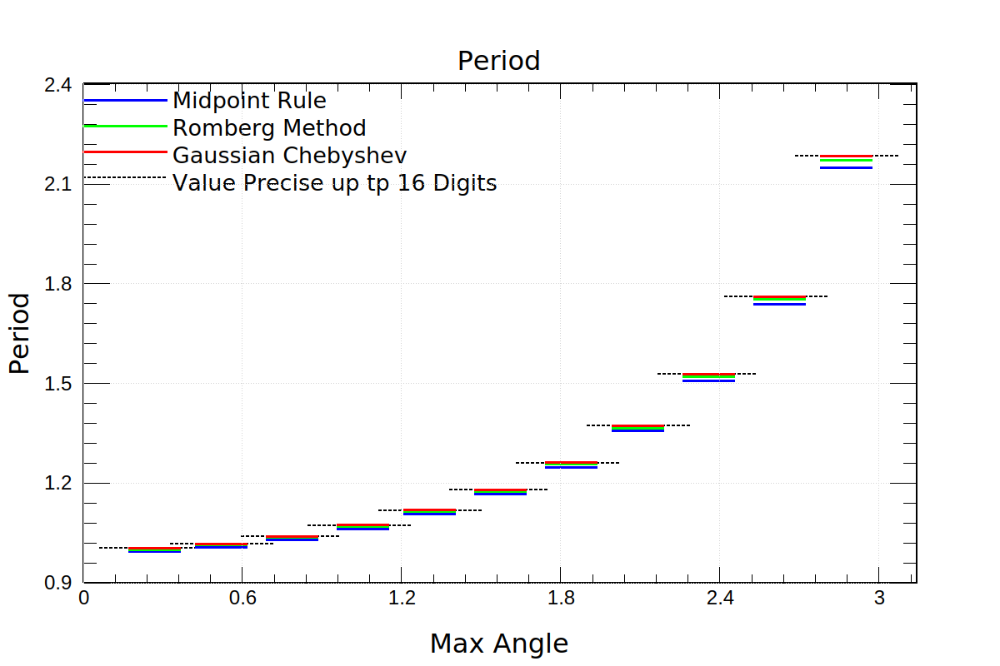
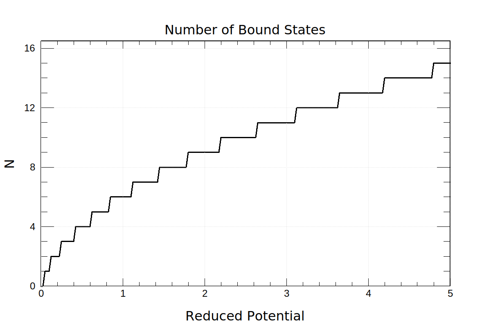

# Assignment 5

#### Shuyang Cao

- [Assignment 5](#assignment-5)
      - [Shuyang Cao](#shuyang-cao)
  - [Chapter 5 Exercise 1](#chapter-5-exercise-1)
  - [Chapter 5 Exercise 2](#chapter-5-exercise-2)
  - [Chapter 5 Exercise 4](#chapter-5-exercise-4)
  - [Chapter 5 Exercise 6](#chapter-5-exercise-6)

## Chapter 5 Exercise 1

$$
\int_0^1 \tanh (x) \, dx = \log (\cosh (1))
$$

$$
\int_0^1 \sqrt{\coth (x)} \, dx = \frac{\pi }{2}+\coth ^{-1}\left(\sqrt{\coth (1)}\right)-\tan ^{-1}\left(\sqrt{\coth (1)}\right)
$$


```bash
$ ./ex1 
Usage: ex1 N n
N: max bin number = 2^N, 1 <= N::int <= 32
n=1: tanh(x)
n=2: sqrt(cosh(x))
```

Depending on ```N```, the elapse time varies from seconds to minutes.

$\tanh (x)$ can be well approximated by taylor series. So different integration methods work as expected. Midpoint rule is slightly better than trapezoid rule. Simpson's rule converges faster than midpoint rule and trapezoid rule.

```bash
$ ./ex1 29 1
```

.png)

$\sqrt{\coth(x)}$ diverges at x = 0. To avoid the singularity, we use open trapezoid rule instead of closed trapeoid rule. For Simpson's rule, we use a composite integration, where the leftmost bin is integrated by midpoint rule and the rest bins are integrated by Simpson's rule. In this case, the convergence rate of Simpson's rule is degraded to be the same as midpoint rule. Open trapezoid rule is slightly better than midpoint rule.

```bash
 ./ex1 29 2
```

).png)


## Chapter 5 Exercise 2

$$
mgl\left(1-\cos(\theta_{\max})\right) = \frac{1}{2}m\left(l\dot{\theta}\right)^2 + mgl(1-\cos(\theta)) 
$$

$$
\Rightarrow  \dot{\theta} = \sqrt{\frac{2g\left(\cos\theta - \cos\theta_{\max} \right)}{l}}
$$

$$
\Rightarrow dt = d\theta \sqrt{\frac{l}{2g\left(\cos\theta - \cos\theta_{\max}\right)}}
$$

$$
\Rightarrow T = T_0\int_{-\theta_{\max}}^{\theta_{\max}}{\frac{1}{\pi\sqrt{2\left(\cos\theta - \cos\theta_{\max}\right)}}d\theta}
$$

$$
\Rightarrow T_0 = 2\pi\sqrt{\frac{l}{g}}
$$

$$
f\left(\theta\right)=\int_{-\theta_{\max}}^{\theta_{\max}}{\frac{1}{\pi\sqrt{2\left(\cos\theta - \cos\theta_{\max}\right)}}d\theta}
$$

In the limit $\theta \ll 1$,

$$
T \approx T_0 \int_{-\theta_{\max}}^{\theta_{\max}}{\frac{1}{\pi\sqrt{2\left({\theta_{\max}}^2 - \theta^2\right)}}d\theta} = T_0
$$

In the program, the integration is completed using three methods. Note that the integrand is singular at end points. To avoid singularities, we need to use midpoint rule and open Romberg method. Actucally, due to singularities, midpoint rule and Romberg method don't work very well in this case. However, these singularities can be perfectly handled by Gauss Chebyshev quadrature of the first kind.

If we rewrite the integration as the following.

$$
f\left(\theta\right)=\frac{\theta_{\max}}{\pi\sqrt{2}}\int_{-1}^{1}{\frac{1}{\sqrt{1-x^2}}\frac{\sqrt{1-x^2}}{\sqrt{\left(\cos\left(\theta_{\max}x\right) - \cos\theta_{\max}\right)}}d\theta}
$$

Define

$$
g\left(\theta\right)=\frac{\sqrt{1-x^2}}{\sqrt{\left(\cos\left(\theta_{\max}x\right) - \cos\theta_{\max}\right)}}
$$

Check convergence of $g\left(\theta\right)$ at endpoints.

$$
\lim_{x\to\pm1}{g\left(\theta\right)} = \sqrt{\frac{2}{\theta_{\max}\sin\theta_{\max}}}
$$

Therefore, as long as $\theta\neq0, \pi$, $g\left(\theta\right)$ doesn't have singular points in the range $\left[-1,1\right]$ and can be well approximated by Chebyshev polynomials of the first kind.

The average relative errors using 1024 sample points are shown below. It's obvious that Gauss Chebyshev quadrature of the first kind works much better than the other two. The machine precision results are computed by Mathematica.

```bash
$ ./ex2 
Simple relative error: 0.0119797
Romberg relative error: 0.00481546
Chebyshev relative error: 4.80984e-09
```



## Chapter 5 Exercise 4

Stationary Schrödinger equation

$$
-\frac{\hbar^2}{2m}\frac{\partial^2}{{\partial x}^2}\psi\left(x\right) - V_0 e^{-\frac{x^2}{2a^2}}\psi\left(x\right) = E\psi\left(x\right)
$$

Choose length unit $x_0=a$ and the reduced position $\xi=x/a$

$$
-\frac{\hbar^2}{2ma^2}\frac{\partial^2}{{\partial \xi}^2}\psi\left(\xi\right) - V_0 e^{-\frac{1}{2}\xi^2}\psi\left(\xi\right) = E\psi\left(\xi\right)
$$

Choose energy unit $E_0=\hbar^2/(2ma^2)$, reduced potential $v=V_0/E_0$ and reduced energy $\epsilon=E/E_0$

$$
-\frac{\partial^2}{{\partial \xi}^2}\psi\left(\xi\right) - v e^{-\frac{1}{2}\xi^2}\psi\left(\xi\right) = \epsilon\psi\left(\xi\right)
$$

The action (eqn 5.16)

$$
\mathcal{J}\left(E\right) = 2 \int_{x_{\min}}^{x_{\max}}{\sqrt{2m\left(E+V_0 e^{-\frac{x^2}{2a^2}}\right)}dx}
$$

Note that $\mathcal{J}\left(E\right)$ is a monotonically increasing function when $E<0$. The number of bound states is

$$
N = \left\lfloor\frac{\mathcal{J}\left(0\right)}{\hbar}-0.5\right\rfloor
$$

$$
\begin{aligned}
    N &  = \left\lfloor\frac{\mathcal{J}\left(0\right)}{\hbar}-0.5\right\rfloor\\
    & = \left\lfloor\frac{4 \sqrt{2 \pi } a \sqrt{m V_0}}{\hbar}-0.5\right\rfloor\\
    & = \left\lfloor4\sqrt{\pi}\sqrt{\frac{V_0}{\frac{\hbar^2}{2ma^2}}}-0.5\right\rfloor\\
    & = \left\lfloor4\sqrt{\pi}\sqrt{v}-0.5\right\rfloor
\end{aligned}
$$

```bash
$ ./ex4
```



## Chapter 5 Exercise 6

The product of $H_i(x)*H_j(x)$ is a $(i+j)$th degree polynomials, whose integration can be computed accurately with at least $\lceil(i+j)/2+0.5\rceil$ sample points. So to verify the orthonormality of the first six eigenstaes, namely, up to $H_5(x)$, we need at leat 6 sample points.

```bash
$ ./ex6 
Number of Sample Point: 1
             1             0       -0.7071             0        0.6124             0
             0             0             0             0             0             0
       -0.7071             0           0.5             0        -0.433             0
             0             0             0             0             0             0
        0.6124             0        -0.433             0         0.375             0
             0             0             0             0             0             0

Number of Sample Point: 2
             1             0    -4.434e-16             0       -0.4082             0
             0             1             0       -0.8165             0        0.5477
    -4.434e-16             0     1.966e-31             0      1.81e-16             0
             0       -0.8165             0        0.6667             0       -0.4472
       -0.4082             0      1.81e-16             0        0.1667             0
             0        0.5477             0       -0.4472             0           0.3

Number of Sample Point: 3
             1             0    -8.327e-16             0     3.331e-16             0
             0             1             0    -6.827e-16             0       -0.5477
    -8.327e-16             0             1             0        -0.866             0
             0    -6.827e-16             0     4.661e-31             0     3.739e-16
     3.331e-16             0        -0.866             0          0.75             0
             0       -0.5477             0     3.739e-16             0           0.3

Number of Sample Point: 4
             1    -3.331e-16    -2.526e-15     1.138e-15     1.413e-15     -5.69e-16
    -3.331e-16             1     1.554e-15    -1.388e-15     9.789e-16     9.714e-16
    -2.526e-15     1.554e-15             1     2.609e-15    -1.483e-15    -5.551e-16
     1.138e-15    -1.388e-15     2.609e-15             1     1.427e-15       -0.8944
     1.413e-15     9.789e-16    -1.483e-15     1.427e-15     7.191e-30    -1.276e-15
     -5.69e-16     9.714e-16    -5.551e-16       -0.8944    -1.276e-15           0.8

Number of Sample Point: 5
             1     4.163e-17    -2.082e-17    -1.804e-16     1.422e-15    -2.529e-16
     4.163e-17             1    -2.498e-16     2.665e-15    -9.714e-16     2.416e-15
    -2.082e-17    -2.498e-16             1    -1.554e-15     6.661e-15    -1.281e-15
    -1.804e-16     2.665e-15    -1.554e-15             1    -2.554e-15     4.058e-15
     1.422e-15    -9.714e-16     6.661e-15    -2.554e-15             1    -1.066e-15
    -2.529e-16     2.416e-15    -1.281e-15     4.058e-15    -1.066e-15     2.514e-29

Number of Sample Point: 6
             1    -1.492e-16    -7.633e-17      1.18e-16    -6.418e-16    -9.368e-17
    -1.492e-16             1     7.633e-17    -1.457e-15     9.714e-17    -1.762e-15
    -7.633e-17     7.633e-17             1     5.551e-17    -4.524e-15     1.388e-16
      1.18e-16    -1.457e-15     5.551e-17             1      2.22e-16    -7.272e-15
    -6.418e-16     9.714e-17    -4.524e-15      2.22e-16             1     1.943e-16
    -9.368e-17    -1.762e-15     1.388e-16    -7.272e-15     1.943e-16             1
```