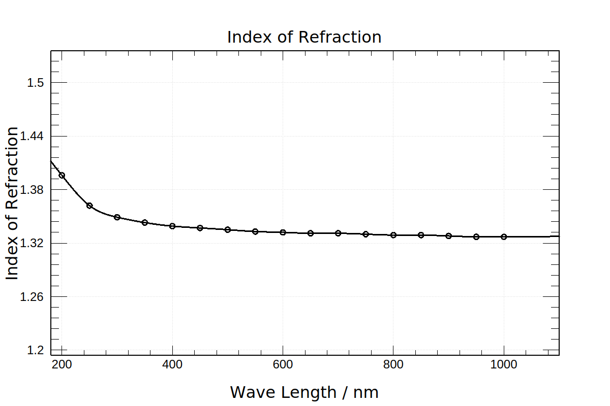
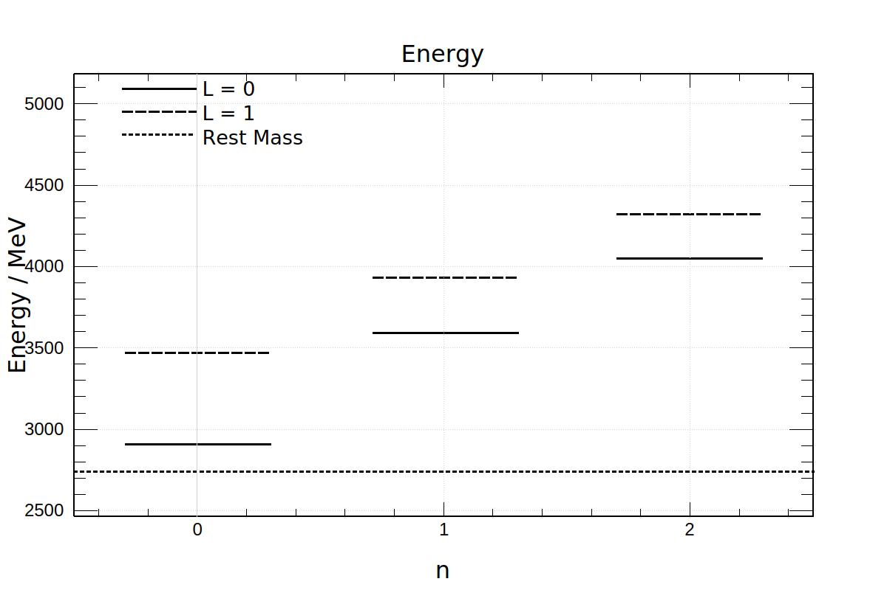
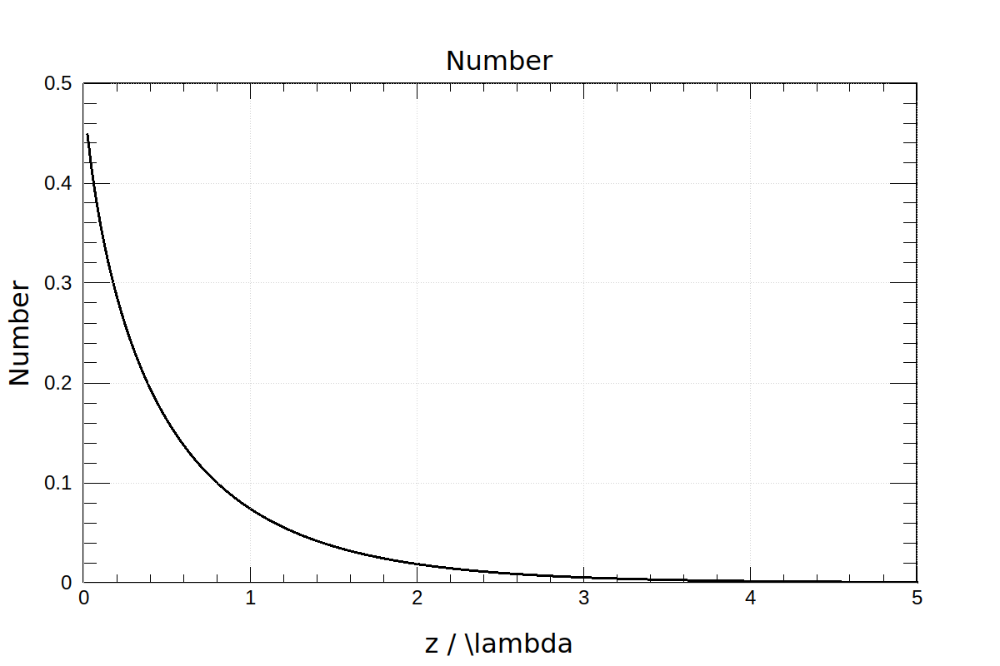

# Assignment 5

#### Shuyang Cao

- [Assignment 5](#assignment-5)
      - [Shuyang Cao](#shuyang-cao)
  - [Chapter 4 Exercise 7](#chapter-4-exercise-7)
  - [Chapter 5 Exercise 7](#chapter-5-exercise-7)
  - [Chapter 5 Exercise 9](#chapter-5-exercise-9)
  - [Chapter 5 Exercise 12](#chapter-5-exercise-12)
    - [Part a](#part-a)
    - [Part b](#part-b)
    - [Part c](#part-c)

## Chapter 4 Exercise 7

Cubic spline interpolation is used.

```bash
 cat ./data.txt | ./dipersion 
```



## Chapter 5 Exercise 7

Use $M(\hat{A})$ to denote the matrix of operator $\hat{A}$ and $\hat{F}(\hat{A})$ to denote the function of operator $\hat{A}$. Then, we have

$$
M(\hat{F}(\hat{A})) = F(M(\hat{A})) 
$$

So, for $\hat{H}, \hat{x}, \hat{D}$, we have

$$
\begin{array}{lcl}
    M(\hat{x}^2) & = & M(\hat{x})^2\\
    M(\hat{D}^2) & = & M(\hat{D})^2\\
    M(\hat{H}) & = & -\frac{1}{2} M(\hat{D})^2 + \frac{1}{2} M(\hat{x})^2
\end{array}
$$

Note that the basis we use the the eigen basis of $\hat{H}$. Thus, the matrix of $\hat{H}$ is diagonal. A value whose magnitude is less than 1e-12 is printed as 0.

```bash
$ ./operator 
x
              0       0.707107              0              0              0
       0.707107              0              1              0              0
              0              1              0        1.22474              0
              0              0        1.22474              0        1.41421
              0              0              0        1.41421              0

x^2
            0.5              0       0.707107              0              0
              0            1.5              0        1.22474              0
       0.707107              0            2.5              0        1.73205
              0        1.22474              0            3.5              0
              0              0        1.73205              0            4.5

D
              0       0.707107              0              0              0
      -0.707107              0              1              0              0
              0             -1              0        1.22474              0
              0              0       -1.22474              0        1.41421
              0              0              0       -1.41421              0

D2
           -0.5              0       0.707107              0              0
              0           -1.5              0        1.22474              0
       0.707107              0           -2.5              0        1.73205
              0        1.22474              0           -3.5              0
              0              0        1.73205              0           -4.5

Hamiltonian
            0.5              0              0              0              0
              0            1.5              0              0              0
              0              0            2.5              0              0
              0              0              0            3.5              0
              0              0              0              0            4.5
```

## Chapter 5 Exercise 9

Effective potential is

$$
V(r)=-\alpha\frac{4\hbar c}{3r} + \frac{r}{\hbar c a^2} + \frac{l(l+1)\hbar^2}{2\mu r^2}
$$

where $\mu=m_c/2$ is the reduced mass. So, the quantization rule is 

$$
\begin{aligned}
       &\int_{r_{\min}}^{r_{\max}}\sqrt{2\mu\left(E-V(r\right)}dr=\left(n+\eta\right)\pi\hbar\\
       \Rightarrow & \int_{r_{\min}}^{r_{\max}}\sqrt{\frac{2\mu E}{\hbar^2}+\frac{8\alpha\mu c}{3\hbar r}-\frac{2\mu r}{\hbar^3ca^2}-\frac{l(l+1)}{r^2}}dr=\left(n+\eta\right)\pi
\end{aligned}
$$

where $\eta=3/4$ if $l=0$, $\eta=1/3$ if $l=1$ because classically particles cannot reach the cener of the system if the angular momentum is nonzero. Choose $b=10^{-15}m$ as the length unit. The reduced position $\xi=x/a$. The quantization rule can be rewritten as

$$
\int_{\xi_{\min}}^{\xi_{\max}}\sqrt{\epsilon+\frac{\beta}{\xi}-\gamma\xi-\frac{l(l+1)}{\xi^2}}d\xi=\left(n+\eta\right)\pi
$$

where

$$
\left\{
\begin{aligned}
       \epsilon & =\frac{E}{E_0}\\
       E_0 & = \frac{\hbar^2}{2\mu b^2}\approx28.4219 \enspace MeV\\
       \beta & = \frac{8\alpha\mu c b}{3\hbar}\approx3.51768\\
       \gamma & = \frac{2\mu b^3}{\hbar^3 c a^2}\approx30.1959
\end{aligned}
\right.
$$



## Chapter 5 Exercise 12

Suppose we wait for a long enough time so that all N atoms decay.

### Part a

$$
\begin{aligned}
       F\left(\frac{z}{\lambda}\right) & = \frac{N}{4\pi}\int_0^{2\pi}d\phi\int_0^\frac{\pi}{2}\sin\theta d\theta \left(1-\int_0^{\frac{z}{\cos\theta}}\frac{1}{\lambda}e^{-\frac{x}{\lambda}}dx\right)\\
       & = \frac{N}{2}\left(e^{-\frac{z}{\lambda}}-\frac{z}{\lambda}\Gamma\left(0,\frac{z}{\lambda}\right)\right)
\end{aligned}
$$

where $\Gamma(a,z)$ is the upper incomplete gamma function. Check ssymptotic behaviours of $\Gamma(\frac{z}{\lambda})$

$$
\begin{aligned}
\lim_{z\to0}F\left(\frac{z}{\lambda}\right) & = \frac{N}{2}\\
\lim_{z\to\infin}F\left(\frac{z}{\lambda}\right) & = 0
\end{aligned}
$$

In the program, N is set to 1.

```bash
$ ./ex12
```



### Part b

Ignore the limit of the speed of light and assume the gamma ray travels through the material instantly. This should be a resonable approximation in practice. The surface flux density is

$$
\begin{aligned}
f & =\int_0^{\infty}\int_0^{\frac{\pi}{2}}\int_0^{2\pi}\left(n r^2 \sin\theta dr d\theta d\phi\right)\left(\frac{1}{\tau}e^{-\frac{t}{\tau}}\right)\left(\frac{\cos\theta}{4\pi r^2}\right)\left(1-\int_0^r \frac{1}{\lambda}e^{-\frac{x}{\lambda}}dx\right)\\
& = \frac{\lambda n}{4} \frac{e^{-\frac{t}{\tau }}}{\tau }
\end{aligned}
$$

### Part c

Define

$$
\left\{
\begin{array}{ll}
Density\enspace of\enspace Granite & \rho = 2.7 g/{cm}^3\\
Weight\enspace fraction\enspace of\enspace K_2O & \alpha=4\%\\
Natural\enspace Abundance\enspace of\enspace K^{40} & \beta=0.012\%\\
Gamma\enspace ray\enspace production\enspace efficiency & \eta=11\%\\
Half\enspace of\enspace K^{40} & t_0={10}^{9} years\\
Mass of K_2O & m = 1.56415\times10^{-22} g
\end{array}
\right.
$$

So,

$$
\begin{aligned}
\tau & = t_0/\ln(2)\\
n &= \frac{2\rho \alpha}{m}\beta
\end{aligned}
$$

Surface flux density

$$
\begin{aligned}
f & = \eta\frac{\lambda n}{4} \frac{e^{-\frac{t}{\tau }}}{\tau }\\
& \approx 0.62602 \left(\frac{1}{2}\right)^{-\frac{t}{1.2\times{10}^{9}yr}} {cm}^{-2}{s}^{-1}
\end{aligned}
$$

If we wait long enough time that all $K^{40}$ decay. Gamma ray surface number density is

$$
N=\int_0^\infin f dt=\frac{n\eta\lambda}{4}\approx3.41782\times{10}^{16}\enspace{cm}^{-2}
$$