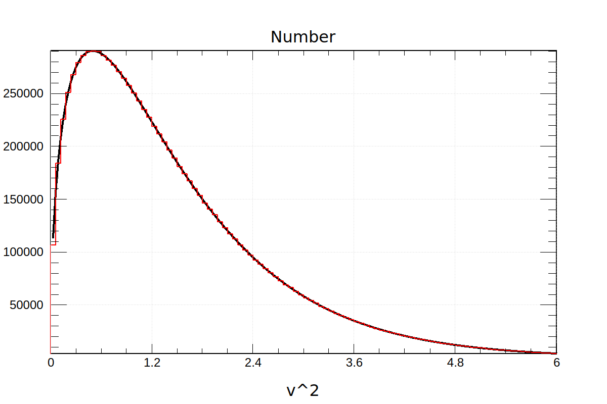
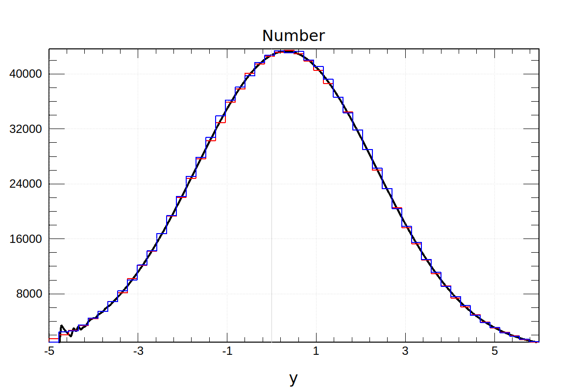
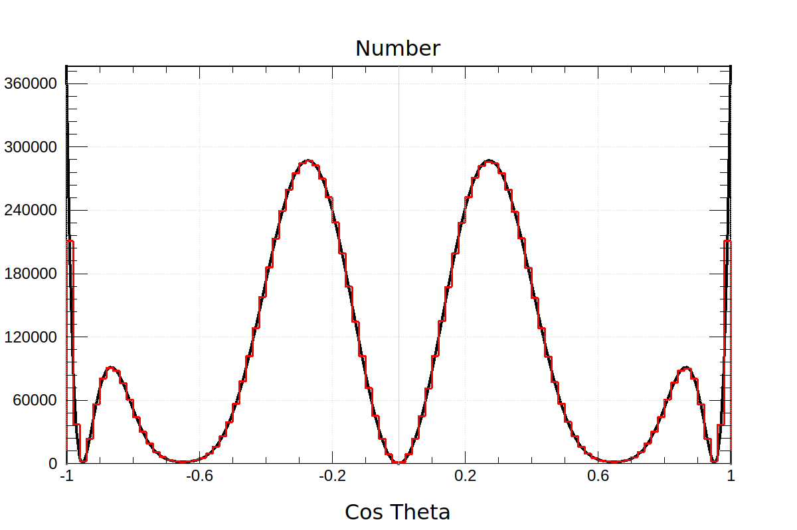

# Assignment 7

#### Shuyang Cao

## Chapter 6 Exercise 1

The initial code is copied from `ACP-Misc/SKELETONS/CH6/STACK`.

Output from the program.

```bash
$ ./client 
Size of stack 8
bottom
1
2
4
8
16
32
64
128
top
Popping 128 from the stack
Popping 64 from the stack
bottom
1
2
4
8
16
32
top
bottom
top
bottom
32
16
8
4
2
1
top
bottom
32
16
8
4
2
1
top

```

If we change `STACK_MAX` to a smaller value, such as 4, an error will be thrown out during the execution of the program.

```bash
$ ./client 
terminate called after throwing an instance of 'std::out_of_range'
  what():  Exceed the capacity of the stack.
```

The `STACK_MAX` is set back to its original value.

## Chapter 6 Exercise 2

The code inherits from `CH6/EX2`.

The content of c is printed at the end of the output. Note that c should be the same as b.

```bash
$ ./client 
Size of stack 8
bottom
1
2
4
8
16
32
64
128
top

Popping 128 from the stack
Popping 64 from the stack
bottom
1
2
4
8
16
32
top

bottom
top

bottom
32
16
8
4
2
1
top

bottom
32
16
8
4
2
1
top

bottom
32
16
8
4
2
1
top
```

Output after messages are added.

```bash
$ ./client 
HELLO from the default constructor.
Size of stack 8
bottom
1
2
4
8
16
32
64
128
top

Popping 128 from the stack
Popping 64 from the stack
bottom
1
2
4
8
16
32
top

HELLO from the default constructor.
bottom
top

bottom
32
16
8
4
2
1
top

ASSIGN from the assignment operator
bottom
32
16
8
4
2
1
top

HELLO from the copy constructor.
bottom
32
16
8
4
2
1
top

GOOD-BYE from the destructor.
GOOD-BYE from the destructor.
GOOD-BYE from the destructor.
```

## Chapter 6 Exercise 3

An extra member variable `_capacity` is added to represent of memory a Stack possesses. Stack is initialzed to be able to accommodate 2 data. Every time the internal array in a Stack is full, the internal array size is doubled at next push. Note that `_capacity` is not a semantic state of a Stack. So `_capacity` will not be copied directly. Instead, in the copy constructor, `_capacity` will be set to `_count`. In the assignment operator, `new` operator will only be invoked when `_capacity` in the destination is smaller than `_capacity` in the source and `_capacity` will only be set to `_count` in this case, otherwise, remain unchanged. This will help increase memory efficiency and performance.

A message is printed out when the stack is extended. So `a` is extended twice to accommodate 8 data (2^3 = 8).

```bash
$ ./client 
HELLO from the default constructor.
Stack is extended.
Stack is extended.
Size of stack 8
bottom
1
2
4
8
16
32
64
128
top

Popping 128 from the stack
Popping 64 from the stack
bottom
1
2
4
8
16
32
top

HELLO from the default constructor.
Stack is extended.
Stack is extended.
bottom
top

bottom
32
16
8
4
2
1
top

ASSIGN from the assignment operator
bottom
32
16
8
4
2
1
top

HELLO from the copy constructor.
bottom
32
16
8
4
2
1
top

GOOD-BYE from the destructor.
GOOD-BYE from the destructor.
GOOD-BYE from the destructor.
```

## Chapter 6 Exercise 4

Note that the basis idea of matrix optics is to describe optical system using matrices. So (one of) the best practice to implement Mueller calculus is inheriting from a Matrix class. `Eigen::Matrix4d` and `EIgen::Vector4d` have already implemented all algebraic operations and output functions. So, we only need to add some extra constructors for convenience. Note that all constructors from `Eigen::Matrix4d` and `EIgen::Vector4d` are inherited. Hence, enssentially `StokesVector` and `MuellerMatrix` can be initialized as a normal `EIgen::Vector4d` or `Eigen::Matrix4d`. Declaration of `StokesVector` and `MuellerMatrix` are shown below.

```c++
class StokesVector: public 	Eigen::Vector4d
{
	public:
		using Eigen::Vector4d::Vector4d;
		enum Type {Horizontal,Vertical,Diagonal,Antidiagonal,RightHand,LeftHand,Unpolarized};

		StokesVector(const double S0, const double S1, const double S2, const double S3);
		StokesVector(const Type type, const double density=1, const double polarization=1);
};

class MuellerMatrix: public Eigen::Matrix4d
{
	public:
		using Eigen::Matrix4d::Matrix4d;
		enum Type {Identity,Horizontal,Vertical,Diagonal,Antidiagonal,FastHorizontal,FastVertical, Mirror};

		MuellerMatrix(const Type type);
		MuellerMatrix(const double transmission);	// Attenuating filter
		MuellerMatrix(const double theta, const double delta);	// General linear retarder
};
```

Output from the example code.

```bash
$ ./client 
Initial vector: density=1, polarization=0.5, Right-hand circularly polarized
  1
  0
  0
0.5

Filter: Horizontal linear polarizer
0.5 0.5   0   0
0.5 0.5   0   0
  0   0   0   0
  0   0   0   0

Filter: Attenuation (Transmission 0.75)
0.75    0    0    0
   0 0.75    0    0
   0    0 0.75    0
   0    0    0 0.75

Filter: Left hand circular polarizer
           1            0            0            0
           0  6.12323e-17  6.12323e-17            1
           0  6.12323e-17            1 -6.12323e-17
           0           -1  6.12323e-17  6.12323e-17

Final vector:
      0.375
2.29621e-17
2.29621e-17
     -0.375

```

## Chapter 7 Exercise 2

Define

$$
\begin{aligned}
	x & = v^2 \Rightarrow dx=2vdv\\
	\beta & = 2\tau/m
\end{aligned}
$$

We get

$$
\rho(v)dv = \frac{1}{\frac{1}{2}\pi^{\frac{1}{2}}\beta^{\frac{3}{2}}}x^{\frac{1}{2}}e^{-\frac{x}{\beta}}dx
$$

Define

$$
\alpha = 3/2
$$

Note that

$$
\Gamma\left(\frac{3}{2}\right)=\frac{\sqrt{\pi}}{2}
$$

We have

$$
\rho(v)dv=\frac{1}{\Gamma(\alpha)\beta^\alpha}x^{\alpha-1}e^{-x/\beta}dx
$$

For simplicity, we define $\beta=1$ in our program. The firgure is shown below, where the number of total data points is $N=10^7$ and the bin width is $w=0.06$. The pdf (black line) is scaled up by $N\times w$.



## Chapter 7 Exercise 5

### a

Two distributions are

$$
\begin{aligned}
	f(x) &=\tau e^{-\tau x}, x\geq0\\
	g(x) &=\frac{1}{\sqrt{2\pi}\sigma}e^{-\frac{x^2}{2\sigma^2}}
\end{aligned}
$$

Their convolution is

$$
(f\ast g)(y)=\frac{1}{2} \tau  e^{\frac{\sigma ^2 \tau ^2}{2}-\tau  y} \left(\text{erf}\left(\frac{y-\sigma ^2 \tau }{\sqrt{2} \sigma }\right)+1\right), -\infty<y<\infty
$$

With $\tau=3,\sigma=2$, the convolution is

$$
(f\ast g)(y)=\frac{3}{2} e^{18-3 y} \left(\text{erf}\left(\frac{y-12}{2 \sqrt{2}}\right)+1\right)
$$

It reaches it maximum 0.1968556435586524 at y=0.324947777562519.

The figure is shown below, where the black line is the analytic PDF, the red line is the histogram off the sum of two random variables, the blue line is the histogram from the rejection method. For the red line, $10^6$ points are sampled. For the blue line, we sample until $10^6$ successful samplings. The statistical rejection rate is 0.759496. The sampled range for the blue line is $[-10,11)$. We can tell from the figure that it is a reasonable approximation of $(-\infty,\infty)$ for this distribution. Note that due to the machine precision, our program failed to give a correct PDF value for $y\lessapprox-4$. This will also affect the rejection method since we need to compute the PDF there, too. But since the PDF value at $y\lessapprox-4$ is already small. This defect will not change the histogram too much. The PDF is scaled up as in CH7/EX2.



## Chapter 7 Exercise 6

Note that

$$
\int_{-1}^{1}\rho(\cos\theta) d\cos\theta = 1
$$

Therefore, we sample $\cos\theta$ as a whole instead of sampling $\theta$. The rejection method is used. We sample until $10^6$ successes.

The maximum of $\rho$ is

$$
\rho_{\max}=\rho(\pm1)
$$

The figure is shown below with $10^7$ successes and a rejection rate of 0.734441. Again, the PDF is scaled.

