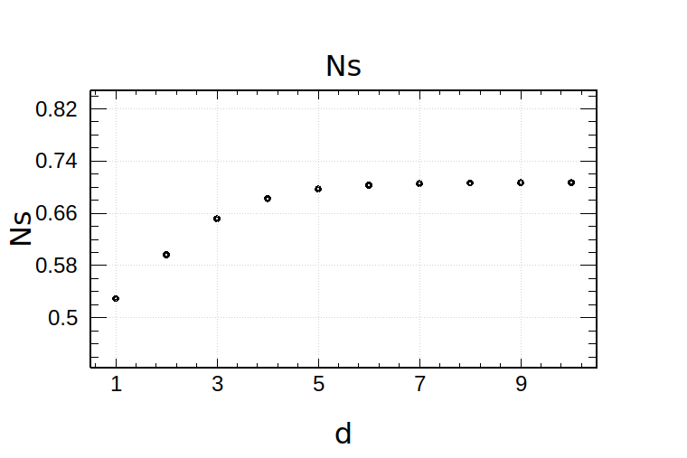
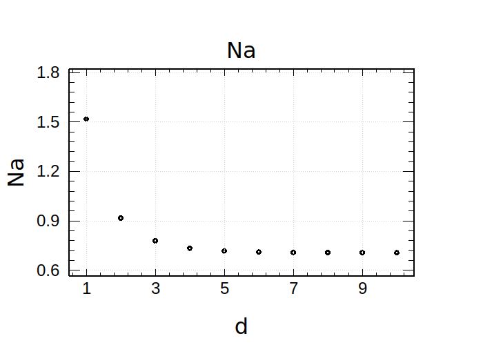
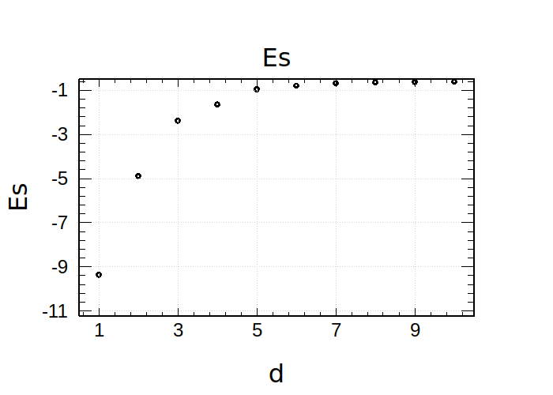
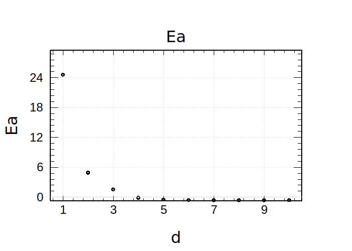

# Assignment 8

#### Shuyang Cao

- [Assignment 8](#assignment-8)
      - [Shuyang Cao](#shuyang-cao)
  - [Chapter 7 Exercise 8](#chapter-7-exercise-8)
  - [Chapter 7 Exercise 9](#chapter-7-exercise-9)
  - [Chapter 7 Exercise 15](#chapter-7-exercise-15)
    - [a](#a)
    - [b](#b)
    - [c](#c)

## Chapter 7 Exercise 8

Define
$$
\psi_\pm = \phi_1 \pm \phi_2
$$
$$
N_+ = N_s, \quad N_- = N_a
$$
$$
H_0 = -\frac{1}{2}\nabla^2 - \frac{1}{r}, \quad \phi_0 = \frac{1}{\sqrt{\pi}}e^{-r}
$$

Then
$$
N_\pm = \frac{1}{\sqrt{\int d^3x {\left|\psi_\pm\right|}^2}}
$$
$$
E_\pm = N_\pm^2 \int d^3x \psi_\pm^* \hat{H} \psi_\pm
$$

By simple observations, we can conclude some asymptotic behaviours.
$$
\lim_{d\to0}N_+ = \frac{1}{2}, \quad \lim_{d\to0}N_- = \infty, \quad \lim_{d\to\infty}N_\pm = \frac{1}{\sqrt{2}}
$$
$$
\lim_{d\to0}E_- = \infty, \quad \lim_{d\to\infty}E_\pm = \langle\phi_0|H_0|\phi_0\rangle = \frac{1}{2}
$$

In our Monte Carlo integration, we choose a sampling function as below.
$$
S(\vec{r}) = \frac{1}{\pi}e^{-2r} \ast \frac{1}{2}\left(\delta\left(\vec{r}-\frac{d}{2}\hat{z}\right) + \delta\left(\vec{r}+\frac{d}{2}\hat{z}\right)\right)
$$

Figures are shown below.

## Chapter 7 Exercise 9

Part c of `CH5-EX12` is merely an application of the reuslt of part b. Thus, we simulate the situation in part b directly. For simplicity, we set $n=1, \lambda=1, \tau=1$. Namely, the decay possibility is

$$
P_{decay}(t) = e^{-t}
$$

and the traveling distance probabilty is

$$
P_{travel}(r) = e^{-r}
$$

We check our simulation against the integrated flux density $F$, i.e.,the total number of gamma rays that reach the surface before time $t$ per surface area. In part b of `CH5-EX12`, the flux density is

$$
f(t) = \frac{\lambda n}{4} \frac{e^{-\frac{t}{\tau }}}{\tau }
$$

Therefore,

$$
F(t) = \int_{0}^t f(t') dt' = \frac{\lambda n}{4} \left(1 - e^{-\frac{t}{\tau}}\right)
$$

Due to the translational symmetry in xy plane, a gamma ray traveling from (x,y,z) to (a,b,0) is the same as a gamma ray traveling from (0,0,z) to (a-x,b-y,0). So we only sample along z axis and count gamma rays reaching the surface. The result is equal to the integrated flux density. To reduce the error, we iterate the simulation 1000 times and average the results. This simulation is time-consuming. Hence, we only check three points.

In practice, we are not able to sample uniformly over an infite range. So we start from a relative small range in z, increase the range step by step and extrapolate to infinity eventually.

| Time | Theorectial Result | Simulated Result |
|------|--------------------|------------------|
|0.5   |0.0983673           |0.100056          |
|1     |0.1580301           |0.151389          |
|2     |0.2161662           |0.229611          |

## Chapter 7 Exercise 15

For $N$ identically distributied random variables $y_i$, whose variance is $V$ and standard deviation is $\sigma$, define
$$
\bar{y}=\frac{1}{N}\sum_{i=1}^N y_i
$$
Then
$$
V_{\bar{y}}=\frac{1}{N}\sum_{i=1}^N V_{y_i}=\frac{V}{N}
$$
$$
\sigma_{\bar{y}} = \sqrt{V_{\bar{y}}} = \frac{\sigma_{\bar{y}}}{\sqrt{N}}
$$

Define
$$
f_1(x) = \frac{e^x-1}{e-1}
$$
Hence,
$$
\langle f_1\rangle=\int_0^1 f_1(x)dx = \frac{e-2}{e-1}
$$

### a

For a single draw,
$$
\langle f_1^2\rangle=\int_0^1 f_1^2 dx = \frac{e (e-4)+5}{2 (e-1)^2}
$$
$$
V_1 = \langle f_1^2\rangle - {\langle f_1\rangle}^2
$$
$$
\sigma_1 = \sqrt{V_1} \approx 0.286316
$$
$$
\sigma = \frac{\sigma_1}{\sqrt{N}} \approx \frac{0.286316}{\sqrt{N}}
$$

For $\sigma/{\langle f_1\rangle}<1\%$, we need $N\geq4692$.

### b

The sampling probility density function is
$$
p(x)=2x
$$
Thus,
$$
\left\langle \frac{f_1}{2x} \right\rangle = \int_0^1 \frac{f_1}{2x}2xdx = \langle f_1\rangle
$$
$$
\left\langle {\left(\frac{f_1}{2x}\right)}^2 \right\rangle = \int_0^1 {\left(\frac{f_1}{2x}\right)}^2 2x dx = \frac{-2 \text{Ei}(1)+\text{Ei}(2)+\gamma -\log (2)}{2 (e-1)^2}
$$
$$
V_2 = \left\langle {\left(\frac{f_1}{2x}\right)}^2 \right\rangle -{\langle f_1\rangle}^2
$$
$$
\sigma_2 = \sqrt{V_2} \approx 0.0523935
$$
$$
\sigma = \frac{\sigma_2}{\sqrt{N}} \approx \frac{0.0523935}{\sqrt{N}}
$$
For $\sigma/{\langle f\rangle}<1\%$, we need $N\geq158$.

### c

$$
\langle f\rangle = \int_0^1 \prod_i f(x_i) d^D x = \prod_i \int_0^1 f(x) dx = {\langle f_1 \rangle}^D
$$
$$
\langle f^2 \rangle = \int_0^1 \prod_i f^2(x_i) d^D x = \prod_i \int_0^1 f^2(x) dx = {\langle f_1^2 \rangle}^D
$$
$$
\left\langle\frac{f}{\prod_i 2x_i}\right\rangle = \int_0^1 \frac{\prod_i f(x_i)}{\prod_i 2x_i}\prod_i 2x_i d^D x = \prod_i \int_0^1 \frac{f(x)}{2x} 2x dx = {\left\langle\frac{f_1}{2x}\right\rangle}^D
$$
$$
\left\langle{\left(\frac{f}{\prod_i 2x_i}\right)}^2\right\rangle = \int_0^1 {\left(\frac{f}{\prod_i 2x_i}\right)}^2 \prod_i 2x_i d^D x = \prod_i \int_0^1 \left(\frac{f_1}{2x}\right)2x dx={\left\langle{\left(\frac{f_1}{2x}\right)}^2\right\rangle}^D
$$
$$
V_a = \frac{\langle f^2 \rangle - {\langle f\rangle}^2}{N} = \frac{{\langle f_1^2 \rangle}^D - {\langle f_1 \rangle}^{2D}}{N}
$$
$$
V_b = \frac{\left\langle{\left(\frac{f}{\prod_i 2x_i}\right)}^2\right\rangle - {\left\langle\frac{f}{\prod_i 2x_i}\right\rangle}^2}{N} = \frac{{\left\langle{\left(\frac{f_1}{2x}\right)}^2\right\rangle}^D - {\left\langle\frac{f_1}{2x}\right\rangle}^{2D}}{N}
$$

Note that
$$
\left\langle{\left(\frac{f_1}{2x}\right)}^2\right\rangle \geq {\left\langle\frac{f_1}{2x}\right\rangle}^{2} = {\left\langle f_1\right\rangle}^{2}
$$
$$
\left\langle{f_1}^2\right\rangle \geq {\left\langle f_1\right\rangle}^{2}
$$

For large D, we have
$$
\begin{aligned}
    \frac{V_b}{V_a} &= \frac{{\left\langle{\left(\frac{f_1}{2x}\right)}^2\right\rangle}^D - {\left\langle\frac{f_1}{2x}\right\rangle}^{2D}}{{\langle f_1^2 \rangle}^D - {\langle f_1 \rangle}^{2D}}\\
    &\approx \frac{{\left\langle{\left(\frac{f_1}{2x}\right)}^2\right\rangle}^D}{{\langle f_1^2 \rangle}^D}\\
    &\approx {\left(\frac{{\left\langle{\left(\frac{f_1}{2x}\right)}^2\right\rangle}}{{\langle f_1^2 \rangle}}\right)}^D
\end{aligned}
$$

Therefor,

$$
a = - \log_{10}{\left(\frac{{\left\langle{\left(\frac{f_1}{2x}\right)}^2\right\rangle}}{{\langle f_1^2 \rangle}}\right)} \approx 0.16029
$$