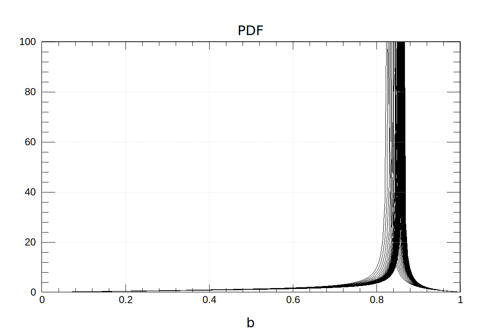
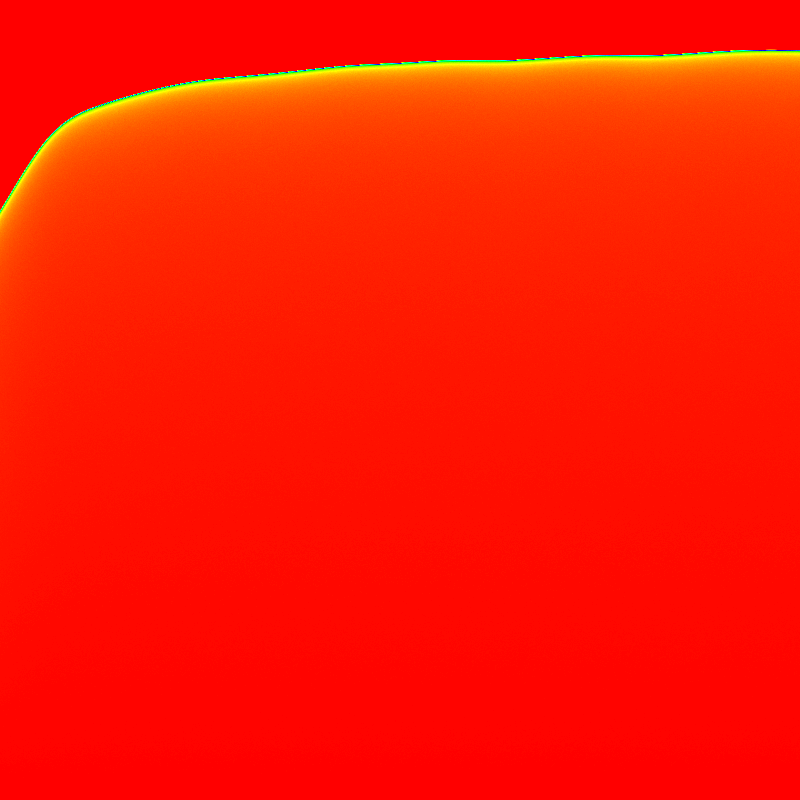
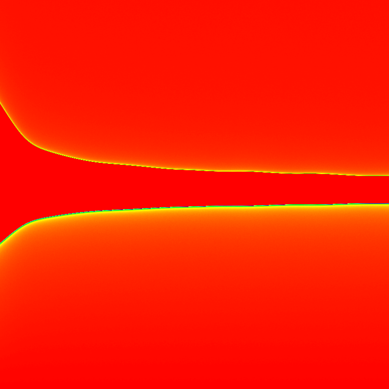

# Assignment 9

#### Shuyang Cao

- [Assignment 9](#assignment-9)
      - [Shuyang Cao](#shuyang-cao)
  - [Chapter 9 Exercise 11](#chapter-9-exercise-11)
    - [a](#a)
    - [b](#b)
    - [c](#c)
    - [e](#e)

## Chapter 9 Exercise 11

### a

For simplicity, we set the radius of the droplet to be $r=1$. Set the impact parameter as $b$. So, $0<b<1$. The angle of incidence is $\alpha=\arcsin{b}$. Set the index of refraction of the water is $n$. So, the angle of fraction is $\beta=\arcsin(b/n)$.

The direction of a light ray changes by $\alpha-\beta$ in one refraction and by $\pi - 2\beta$ in one internal reflection. Hence, after the process one refaction -> one reflection -> one refraction, assuming the light incidents in the +z direction, the polar angle of the outgoing light is 

$$
\begin{aligned}
    \theta &= \alpha-\beta+\pi-2\beta+\alpha-\beta \\
    &= 2\alpha-4\beta+\pi \\
    &=2\arcsin b - 4\arcsin(b/n) + \pi
\end{aligned}
$$

We assume a uniform distribution in the impact disk. Due to the rotational symmetry, we only consider the radial part. Hence, the distribution of the impact parameter $b$ is
$$
P_b(b) = 2b, \quad 0<b<1
$$

The distribution of the polar angle $\theta$ is

$$
P_\theta(\theta) = P_b(b(\theta))\cdot\left|\frac{d b}{d\theta}\right|
$$

Note this formula is actullay not correct because $\theta(b)$ is not invertible. But it will not affect the illustration of maximally possible angle. We rewrite $P_\theta$ as

$$
\begin{aligned}
    P_\theta(b_\theta) &= P_b(b) \cdot \frac{1}{\left|\frac{d\theta}{db}\right|} \\
    &= \frac{2b}{\left| \frac{2}{\sqrt{1-b^2}}-\frac{4}{\sqrt{n^2-b^2}}\right| }
\end{aligned}
$$

With $n$ from the interpolation of table 4.3, PDFs of different $n$'s with $\lambda\in[200nm, 1000nm]$ are overlaped and shown below.



The PDF peaks at $b\approx0.857$, which corresponds to $\theta\approx138.929\degree$ with a typical $n=1.34$. Inverting the direction of the z axis, $\theta\approx41.071$

Actually, $P_\theta(b_\theta)$ reaches a peak when
$$
\frac{d\theta}{db}=0\Rightarrow b_{peak}=\sqrt{\frac{4-n^2}{3}}
$$
For typical $n=1.34$, $b_{peak}\approx0.857205\Rightarrow\theta_{peak}\approx138.929\degree$. Inverting the direction of z axis, $\theta_{peak}\approx41.071\degree$.

### b

I didn't find a clear formula that convert a spectrum to a RGB color. So I attack this problem in a physicist's way. We make a 2d histogram and draw a psudocolor figure to show spectrum at each angle $\theta$. We will find the sprectrum at different $\theta$ reaches peak at different $\lambda$. Hence, different colors are percieved at different $\theta$. 

The color bar for part b,c and e is

$0$  $1$

The figure is shown below, where the horizontal axis $\lambda$ goes from $200nm$ to $1000nm$, the vertical axis goes from $0$ to $0.8$. Note that agian, we choose z-axis to points to the opposite direction of the incident light.


### c

`MPI` provides a mechanism for processes to communicate using arrays of primitive datatypes but `Hist2D` doesn't provide an interface to serialize itself. Thus, we have to store the data of `Hist2D` in a 2D double array and combine data from all workers in `MASTER` process manually. The result is shown below, where the positive direction and axes are the same as those in part b. $10^8$ photons are sampled per process.

```bash
$ mpirun -n 2 ./parallelsimu
group size: 2  taskID: 0
group size: 2  taskID: 1
Worker 1 sends data to Master.
Master recieves data from worker 1
Image saved.

```



### e

Following the same steps in part a, the outgoing direction of the light after two internal reflection is

$$
\begin{aligned}
    \theta &= \alpha-\beta+2(\pi-2\beta)+\alpha-\beta \\
    &= 2\alpha - 6\beta + 2\pi
\end{aligned}
$$

Choosing the positive direction to be the opposite direction of the incident direction, the angle is

$$
\theta = 6\beta - 2\alpha - \pi
$$

Note that $\theta\in[0,\pi]$. We need to fold the value given by the above expression using the following steps.

1. Fold $\theta$ to the range $[0,2\pi)$.
2. If $\theta\in[0,2\pi]$, we already get the desired value. Otherwise,
3. $\theta=2\pi-\theta$.

We choose the +z direction to be the opposite direction of the incident light. The horizontal aixs is $\lambda$ ranging from $200nm$ to $1000nm$. The vertical axis is $\theta$ ranging from $0$ to $\pi/2$. Note the color order of the second rainbow is opposite to the first rainbow.

Note that in the simulation, we didn't consider partial reflections and partial refractions. Whenever an angle can be lighted up by a photon, we add $1$ in that angle. Therefore, when simulating the second rainbow, a photon lights up two angles and the number of photons of these two angles are added $1$.

```bash
$ mpirun -n 2 ./parallelsimu
group size: 2  taskID: 0
group size: 2  taskID: 1
Worker 1 sends data to Master.
Master recieves data from worker 1
Image saved.
```

