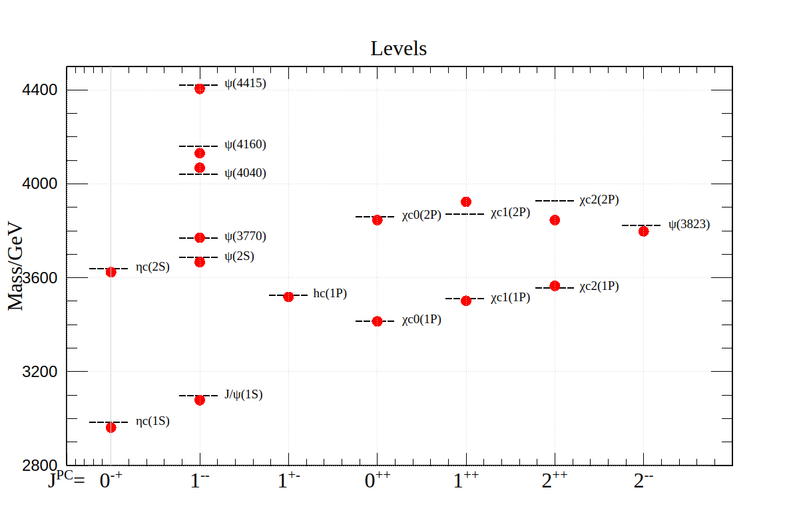

# Final Project

#### Shuyang Cao

## Main Result

$$
H = -\frac{\hbar^2}{2\mu}\frac{d^2}{dr^2} + V_c(r) + V_s(r) + V_{hyp}(r) + V_{fs}(r)
$$

where

$$
\begin{aligned}
    \mu & = \frac{m_c}{2}\\
    V_c(r) & = \frac{l\left(l+1\right)\hbar^2}{2\mu r^2 }\\
    V_s(r) & = -\frac{4\alpha_s}{3r} + b r \\
    V_{hyp}(r) & = \frac{32\pi\alpha_s}{9m_c^2} {\left(\frac{\sigma}{\sqrt{\pi}}\right)}^3 e^{-\sigma^2 r^2} \vec{S_c}\cdot\vec{S_{\bar{c}}} \\
    V_{fs} & = \left(\frac{2\alpha_s}{r^3} - \frac{b}{2r}\right)\frac{1}{m_c^2} \vec{L}\cdot\vec{S} + \frac{4\alpha_s}{m_c^2 r^3} T \\
    T & = \vec{S_c}\cdot\hat{r}\vec{S_{\bar{c}}}\cdot\hat{r} - \frac{1}{3}\vec{S_c}\cdot\vec{S_{\bar{c}}}
\end{aligned}
$$

The diagonal element of $T$ can be computed using equation (3) of this [paper](https://doi.org/10.1103/PhysRevD.72.054026).

The fast change of $V_{fs}(r)$ near $r=0$ under some conditions will lead unphysical results because the finite difference method cannot capture those fast changing features. Therefore, the Hamiltonian matrix to be diagonalized is

$$
H = -\frac{\hbar^2}{2\mu}\frac{d^2}{dr^2} + V_c(r) + V_s(r) + V_{hyp}(r)
$$

The energy contribution of $V_{fs}$ will be treated with a perturbation method up to the first order. If uncommenting the following code segment in `src/charmonia.cpp/Charmonia::Charmonia(const State&, const int, const double)`

```cpp
for (int i = 0; i < matrixSize; i++)
{
    if (i != sIndex)
    {
        double Es = es.eigenvalues()(sIndex);
        double Ei = es.eigenvalues()(i);
        Eigen::VectorXd psiI = 
            es.eigenvectors().col(i).normalized() / sqrt(delta);
        double prod = (psiI.array() * Vfs * psi.array()).sum() * delta;
        correction += (prod*prod) / (Es - Ei);
    }
}
```

one would be able to compute the energy correction due to $V_{fs}$ up to the second order. It turns out that going to the second order doesn't always give us a better result. Because sometimes the perturbation from $V_{fs}$ is actually. A figure of results up to the first order of perturbation is shown below.



## Remarks on Fitting

The interface for minimization is already implemented in class `Charmonia`. But it turns out that I am over-optimistic on this issue for two reasons.

1. Because we adopt perturbation method. We need to compute both eigenvalues and eigenvectors, which takes much longer time than computing only eigenvalues. If we further embed this method into an iterative minimization, getting result in a reasonable time exceeds the capability of a laptop. By the way, the `Eigen` library doesn't provide an eigenvalue solver for sparse matrice. So this problem cannot be eased by going to sparse matrice.
2. More importantly, we adopt a discretization method, which means we can increase the accuray by simply decreasing the step size. If we double the number of points we use, we would find the improvement is already comparable with the difference between calculated results and experimental data. This means that with the current choice of steps, the error duce to values of parameters in our model is not dominant. Thus, it doesn't make much sense to fit on data under this condition. On the other hand, decreasing the step size cause the computing time unacceptable on a laptop.

